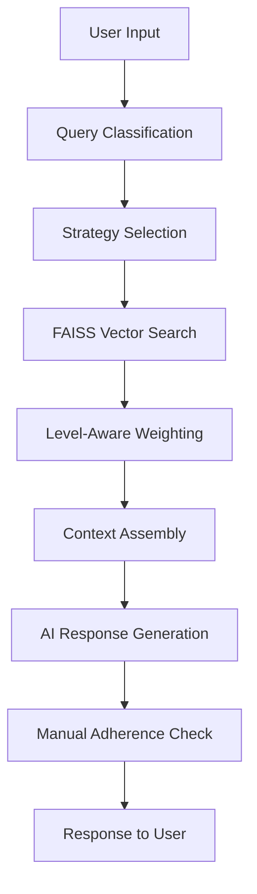
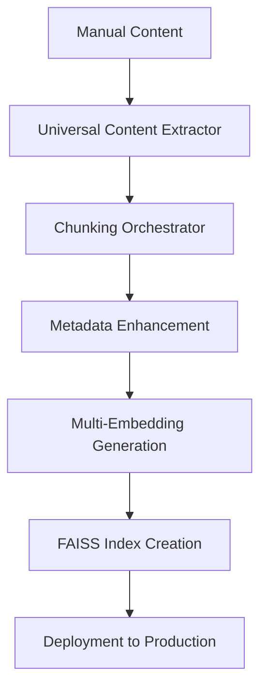
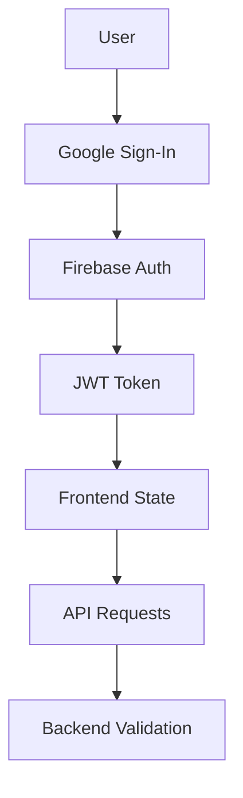

# System Architecture

This document provides a comprehensive overview of the Universal Manual RAG Chat system architecture, including components, data flow, and design decisions.

## 🏗️ High-Level Architecture

```
┌─────────────────┐    ┌─────────────────┐    ┌─────────────────┐
│   Flutter Web   │    │  Firebase Auth  │    │ Google Cloud    │
│   Mobile App    │◄──►│   Functions     │◄──►│ Speech APIs     │
└─────────────────┘    └─────────────────┘    └─────────────────┘
         │                       │                       │
         ▼                       ▼                       ▼
┌─────────────────┐    ┌─────────────────┐    ┌─────────────────┐
│  Firestore DB   │    │  Firebase       │    │  FastAPI        │
│  Cloud Storage  │    │  Hosting        │    │  Backend        │
└─────────────────┘    └─────────────────┘    └─────────────────┘
                                                       │
                                                       ▼
                                             ┌─────────────────┐
                                             │ Enhanced RAG    │
                                             │ System (FAISS)  │
                                             └─────────────────┘
```

## 🎯 Core Components

### Frontend (Flutter)

**Location**: `chatbot_frontend/`
**Framework**: Flutter 3.x with Dart
**Platforms**: Web, iOS, Android

#### Key Components
- **Authentication**: Google Sign-In with Firebase Auth
- **Chat Interface**: Real-time messaging with voice input/output
- **State Management**: Provider pattern for state management
- **Audio Handling**: Speech-to-text and text-to-speech integration
- **Image Display**: Firebase Storage image rendering with CORS handling

#### Directory Structure
```
chatbot_frontend/
├── lib/
│   ├── models/          # Data models
│   ├── screens/         # UI screens
│   ├── services/        # API services
│   ├── widgets/         # Reusable components
│   └── main.dart        # App entry point
├── functions/           # Firebase Functions
├── web/                 # Web assets
└── assets/              # Static assets
```

### Backend (FastAPI)

**Location**: `chatbot_backend/`
**Framework**: FastAPI with Python 3.11+
**Deployment**: Google Cloud Run

#### Architecture Layers

##### 1. API Layer (`api/`)
- **Chat Routes**: Message processing endpoints
- **STT/TTS Routes**: Audio processing endpoints
- **Debug Routes**: System status and monitoring

##### 2. Agent Layer (`agent/`)
- **Chat Manager**: Orchestrates AI interactions
- **Retrieval System**: Manages RAG operations
- **Prompt Engineering**: AI prompt templates
- **Embedding Service**: Vector generation

##### 3. Application Layer (`app/`)
- **Configuration**: Environment and settings
- **FAISS Service**: Vector search operations
- **Firebase Service**: Storage and authentication
- **Startup**: Application initialization

##### 4. Enhanced RAG System (`training/`)
- **Content Processing**: Universal manual processing
- **Vector Generation**: Multi-embedding creation
- **Metadata Enhancement**: Customer support optimization

## 🧠 Enhanced RAG System Architecture

### Multi-Level Chunk Hierarchy

```
L0: Quick Facts (Instant answers)
 ├── LED indicators
 ├── Status meanings
 └── Quick troubleshooting

L1: Procedures (Step-by-step)
 ├── Setup instructions
 ├── Configuration steps
 └── Maintenance tasks

L2: Comprehensive Summaries
 ├── Section overviews
 ├── Feature explanations
 └── Detailed descriptions

QA: Question-Answer Pairs
 ├── Common questions
 ├── FAQ responses
 └── User scenarios

L3: Full Document Context
 ├── Complete sections
 ├── Full procedures
 └── Comprehensive guides

L4: Cross-References
 ├── Related sections
 ├── See-also references
 └── Contextual links
```

### Multi-Embedding Strategy

```python
# Content Embeddings
content_embedding = embed_model.embed(chunk_text)

# Question Embeddings
questions = generate_questions(chunk_text)
question_embedding = embed_model.embed(" ".join(questions))

# Combined Embeddings
combined_text = f"{chunk_text} {' '.join(questions)}"
combined_embedding = embed_model.embed(combined_text)

# Storage
embeddings = {
    'content': content_embedding,
    'questions': question_embedding,
    'combined': combined_embedding
}
```

### Search Strategy Implementation

#### 1. Query Classification System

```python
def classify_query(query: str) -> str:
    patterns = {
        'quick_facts': [
            r'\b(what|meaning|means|indicates?)\b.*\b(led|light|indicator|status)\b',
            r'\b(red|green|blue|amber|orange)\b.*\b(light|led)\b',
            r'\bquick\b.*\b(answer|info|status)\b'
        ],
        'troubleshooting': [
            r'\b(not work|broken|issue|problem|error|fail)\b',
            r'\b(fix|resolve|solve|repair)\b',
            r'\b(wifi|internet|connection).*\b(not work|down|slow)\b'
        ],
        'setup': [
            r'\b(how to|setup|install|configure|connect)\b',
            r'\b(step|instruction|guide|tutorial)\b',
            r'\b(initial|first time|new)\b.*\b(setup|installation)\b'
        ],
        'progressive': [
            r'\b(explain|describe|overview|understand)\b',
            r'\b(what is|how does|why)\b',
            r'\b(feature|function|capability)\b'
        ]
    }

    for strategy, pattern_list in patterns.items():
        for pattern in pattern_list:
            if re.search(pattern, query.lower()):
                return strategy

    return 'progressive'  # Default strategy
```

#### 2. Level-Aware Search Weights

```python
def apply_level_weights(results: List[SearchResult]) -> List[SearchResult]:
    level_weights = {
        'L0': 1.2,  # Quick facts boost
        'QA': 1.3,  # Question-answer boost
        'L1': 1.0,  # Standard weight
        'L2': 1.0,  # Standard weight
        'L3': 0.9,  # Slight penalty for verbose content
        'L4': 0.8   # Lower weight for cross-references
    }

    for result in results:
        level = result.metadata.get('level', 'L1')
        result.score *= level_weights.get(level, 1.0)

    return sorted(results, key=lambda x: x.score, reverse=True)
```

#### 3. Strategy-Specific Search Logic

```python
def search_with_strategy(query: str, strategy: str) -> List[Chunk]:
    if strategy == 'quick_facts':
        # Prioritize L0 chunks with question embeddings
        return faiss_service.search(
            query,
            embedding_type='questions',
            level_filter=['L0', 'QA'],
            top_k=3
        )

    elif strategy == 'troubleshooting':
        # Progressive search: L0 → L2 → L1 → L4
        results = []
        for levels in [['L0'], ['L2'], ['L1'], ['L4']]:
            batch = faiss_service.search(
                query,
                level_filter=levels,
                top_k=2
            )
            results.extend(batch)
            if len(results) >= 6:
                break
        return results

    elif strategy == 'setup':
        # Focus on procedural content
        return faiss_service.search(
            query,
            embedding_type='content',
            level_filter=['L1', 'L2'],
            top_k=5
        )

    else:  # progressive
        # Adaptive multi-level search
        return faiss_service.search(
            query,
            embedding_type='combined',
            top_k=8
        )
```

## 🔍 Data Flow Architecture

### 1. User Query Processing



### 2. Manual Processing Pipeline



### 3. Authentication Flow



## 📊 Database Schema

### Firestore Collections

#### Users Collection
```typescript
interface User {
  uid: string;
  email: string;
  displayName: string;
  photoURL?: string;
  createdAt: Timestamp;
  lastLoginAt: Timestamp;
  preferences: {
    voiceName: string;
    speechRate: number;
    darkMode: boolean;
  };
}
```

#### Chat Sessions Collection
```typescript
interface ChatSession {
  id: string;
  userId: string;
  title: string;
  createdAt: Timestamp;
  updatedAt: Timestamp;
  messages: Message[];
  metadata: {
    totalMessages: number;
    avgResponseTime: number;
    manualSections: string[];
  };
}

interface Message {
  id: string;
  type: 'user' | 'assistant';
  content: string;
  timestamp: Timestamp;
  audioUrl?: string;
  searchMetadata?: {
    strategy: string;
    chunksUsed: number;
    responseTimeMs: number;
  };
}
```

### Vector Storage Schema

#### FAISS Index Structure
```python
# Enhanced metadata structure
{
    "chunk_id": "unique_identifier",
    "content": "chunk_text_content",
    "level": "L0|L1|L2|QA|L3|L4",
    "support_category": "quick_facts|troubleshooting|setup|general",
    "search_weight": 1.0,
    "manual_section": "section_name",
    "difficulty_level": "beginner|intermediate|advanced",
    "estimated_time": "1-5 minutes",
    "prerequisites": ["requirement1", "requirement2"],
    "success_indicators": ["indicator1", "indicator2"],
    "escalation_path": "next_level_support",
    "user_questions": ["question1", "question2"],
    "embeddings": {
        "content": [768_dimensional_vector],
        "questions": [768_dimensional_vector],
        "combined": [768_dimensional_vector]
    }
}
```

## 🛡️ Security Architecture

### Authentication & Authorization

```python
# Firebase JWT validation
async def validate_firebase_token(token: str) -> Optional[dict]:
    try:
        decoded_token = auth.verify_id_token(token)
        return decoded_token
    except Exception:
        return None

# Request middleware
@app.middleware("http")
async def auth_middleware(request: Request, call_next):
    if request.url.path.startswith("/protected"):
        token = request.headers.get("Authorization", "").replace("Bearer ", "")
        user = await validate_firebase_token(token)
        if not user:
            return JSONResponse(status_code=401, content={"error": "Unauthorized"})
        request.state.user = user

    response = await call_next(request)
    return response
```

### CORS Configuration

```python
# Production CORS settings
app.add_middleware(
    CORSMiddleware,
    allow_origins=[
        "https://yourdomain.com",
        "https://your-app.web.app",
        "https://your-app.firebaseapp.com"
    ],
    allow_credentials=True,
    allow_methods=["GET", "POST", "OPTIONS"],
    allow_headers=["Authorization", "Content-Type"],
)
```

### Data Privacy

- **PII Handling**: User data encrypted at rest
- **Audit Logging**: All API calls logged with user context
- **Data Retention**: Configurable retention policies
- **GDPR Compliance**: User data export/deletion endpoints

## ⚡ Performance Architecture

### Caching Strategy

```python
# Multi-level caching
@lru_cache(maxsize=1000)
def get_cached_embeddings(text_hash: str):
    return embedding_service.embed(text)

# Redis caching (future implementation)
async def get_search_results(query: str, strategy: str):
    cache_key = f"search:{hashlib.md5(query.encode()).hexdigest()}:{strategy}"
    cached = await redis.get(cache_key)

    if cached:
        return json.loads(cached)

    results = await faiss_service.search(query, strategy)
    await redis.setex(cache_key, 300, json.dumps(results))  # 5 min cache
    return results
```

### Async Processing

```python
# Async endpoint design
@app.post("/chat/send")
async def send_message(request: ChatRequest):
    # Parallel processing
    search_task = asyncio.create_task(
        faiss_service.search_async(request.message)
    )

    classification_task = asyncio.create_task(
        classify_query_async(request.message)
    )

    search_results, strategy = await asyncio.gather(
        search_task, classification_task
    )

    # Generate response
    response = await ai_service.generate_response(
        request.message, search_results, strategy
    )

    return ChatResponse(
        response=response,
        strategy=strategy,
        response_time_ms=timer.elapsed()
    )
```

### Resource Optimization

```python
# Memory-efficient vector loading
class LazyFAISSService:
    def __init__(self):
        self._index = None
        self._metadata = None

    @property
    def index(self):
        if self._index is None:
            self._index = faiss.read_index("enhanced_index.faiss")
        return self._index

    @property
    def metadata(self):
        if self._metadata is None:
            with open("metadata_enhanced.pkl", "rb") as f:
                self._metadata = pickle.load(f)
        return self._metadata
```

## 🔧 Configuration Management

### Environment Configuration

```python
# app/config.py
class Settings(BaseSettings):
    project_id: str = Field(..., env="PROJECT_ID")
    location: str = Field("us-central1", env="LOCATION")

    # AI Configuration
    generative_model: str = Field("gemini-2.5-flash", env="GENERATIVE_MODEL_NAME")
    embedding_model: str = Field("text-embedding-004", env="EMBEDDING_MODEL_NAME")

    # Performance Settings
    max_concurrent_requests: int = Field(100, env="MAX_CONCURRENT_REQUESTS")
    vector_search_timeout: float = Field(1.0, env="VECTOR_SEARCH_TIMEOUT")

    # Feature Flags
    enable_voice_features: bool = Field(True, env="ENABLE_VOICE_FEATURES")
    enable_image_proxy: bool = Field(True, env="ENABLE_IMAGE_PROXY")
    strict_manual_adherence: bool = Field(True, env="STRICT_MANUAL_ADHERENCE")

    class Config:
        env_file = ".env"
        case_sensitive = False
```

### Manual Configuration

```yaml
# training/config/manual_config.yaml
manual_config:
  domain: "electronics"
  processing:
    chunk_size_tokens: 500
    overlap_tokens: 50
    min_chunk_size: 100

  hierarchy:
    levels:
      L0: "quick_facts"
      L1: "procedures"
      L2: "summaries"
      QA: "questions"
      L3: "documents"
      L4: "references"

  search_weights:
    L0: 1.2
    QA: 1.3
    L1: 1.0
    L2: 1.0
    L3: 0.9
    L4: 0.8

  patterns:
    quick_facts:
      - "indicator patterns"
      - "status meanings"
      - "error codes"

    troubleshooting:
      - "problem resolution"
      - "diagnostic steps"
      - "error handling"
```

## 🚀 Deployment Architecture

### Cloud Run Configuration

```yaml
# cloud-run-config.yaml
apiVersion: serving.knative.dev/v1
kind: Service
metadata:
  name: ai-agent-service
  annotations:
    run.googleapis.com/ingress: all
spec:
  template:
    metadata:
      annotations:
        autoscaling.knative.dev/minScale: "1"
        autoscaling.knative.dev/maxScale: "100"
        run.googleapis.com/cpu-throttling: "false"
        run.googleapis.com/memory: "4Gi"
        run.googleapis.com/cpu: "2"
    spec:
      containerConcurrency: 80
      timeoutSeconds: 300
      containers:
      - image: gcr.io/PROJECT_ID/ai-agent-service
        resources:
          limits:
            cpu: "2"
            memory: "4Gi"
        env:
        - name: PROJECT_ID
          value: "your-project-id"
        - name: LOCATION
          value: "us-central1"
```

### Monitoring & Observability

```python
# Structured logging
import structlog

logger = structlog.get_logger()

@app.post("/chat/send")
async def send_message(request: ChatRequest):
    start_time = time.time()

    logger.info(
        "chat_request_received",
        user_id=request.user_id,
        message_length=len(request.message),
        timestamp=start_time
    )

    try:
        response = await process_message(request)

        logger.info(
            "chat_response_generated",
            user_id=request.user_id,
            response_time_ms=(time.time() - start_time) * 1000,
            strategy=response.strategy,
            chunks_used=response.chunks_used
        )

        return response

    except Exception as e:
        logger.error(
            "chat_request_failed",
            user_id=request.user_id,
            error=str(e),
            response_time_ms=(time.time() - start_time) * 1000
        )
        raise
```

## 🔮 Future Architecture Enhancements

### Planned Improvements

1. **WebSocket Support**: Real-time bidirectional communication
2. **GraphQL API**: More flexible data fetching
3. **Microservices**: Split into specialized services
4. **Event-Driven Architecture**: Async processing with Pub/Sub
5. **ML Pipeline**: Continuous model improvement
6. **Multi-Region Deployment**: Global latency optimization

### Scalability Roadmap

```python
# Future microservices architecture
services = {
    "gateway": "API Gateway & Load Balancer",
    "auth": "Authentication & Authorization",
    "chat": "Chat Processing & Response Generation",
    "rag": "RAG System & Vector Search",
    "voice": "Speech-to-Text & Text-to-Speech",
    "analytics": "Usage Analytics & Monitoring",
    "admin": "Admin Dashboard & Management"
}
```

This architecture provides a solid foundation for scaling the Universal Manual RAG Chat system while maintaining performance, security, and reliability.